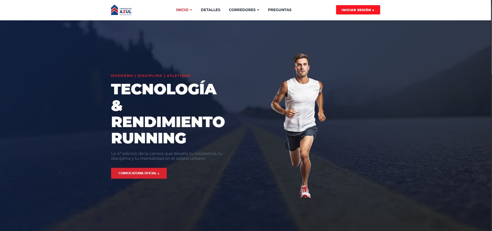
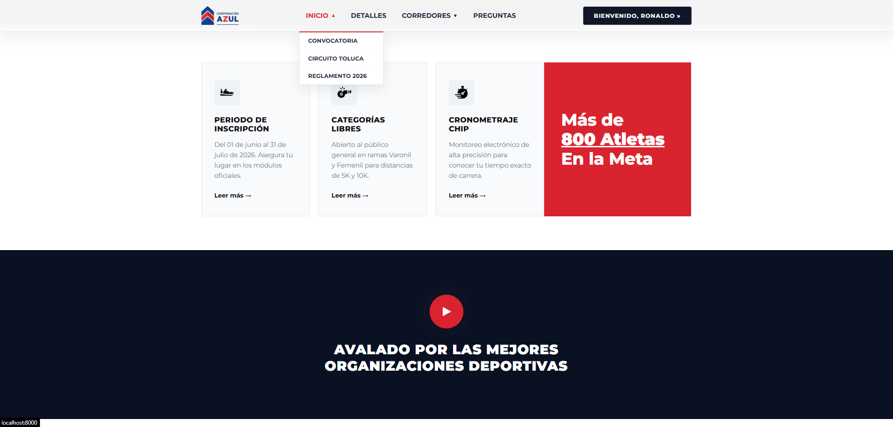
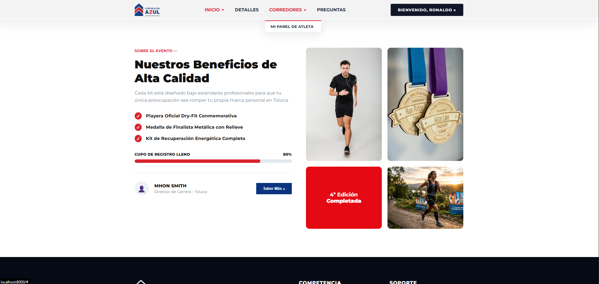
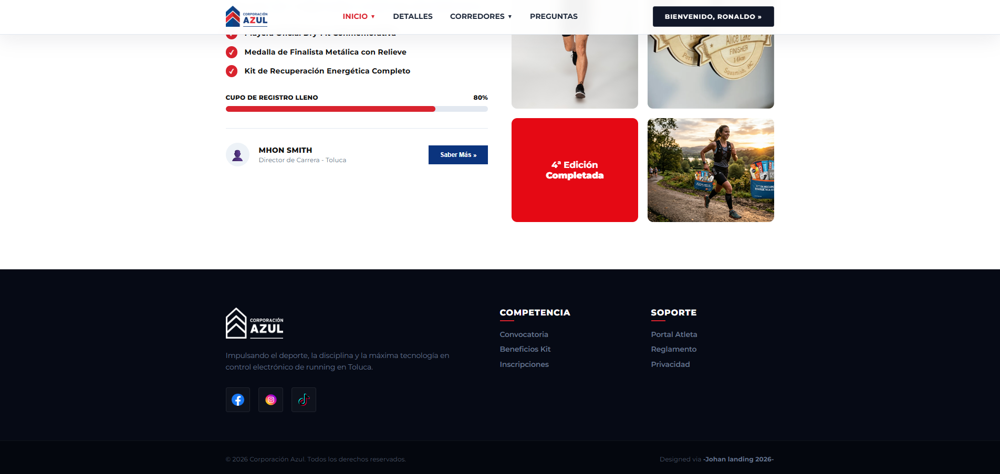
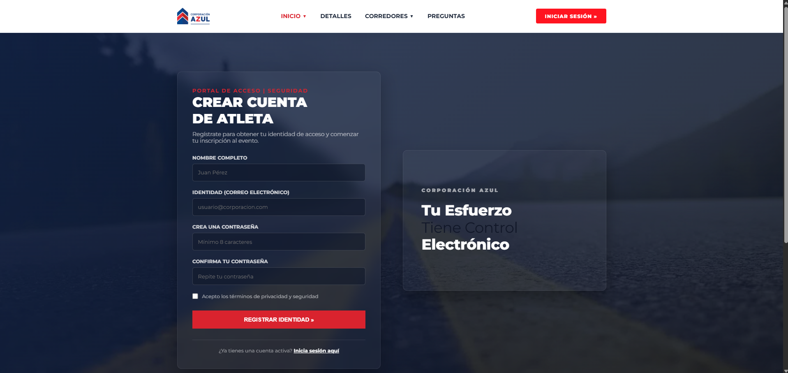
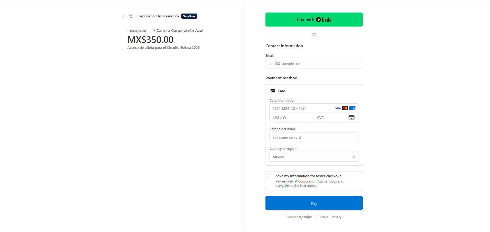
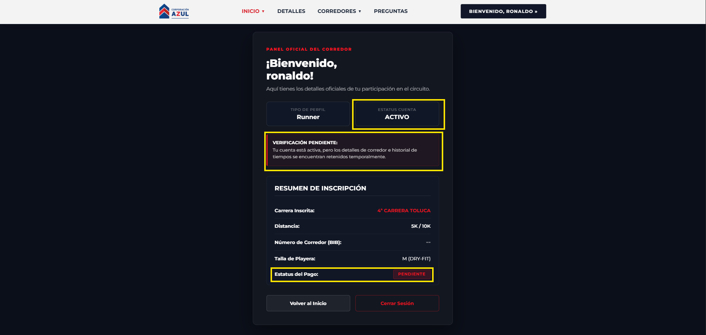

# Circuito Toluca 2026 - Carrera Corporación Azul

Welcome! This is a modern web-based registration and automated race tracking system built with **Laravel 11** and integrated with **Stripe API** for automatic payment processing, secure athlete entry registration, and real-time backend verification.

---

## Key Features

* **User Registration & Authentication**: Complete flow for runners to create an account, log in, and check their operational race dashboard status.
* **Stripe Checkout Integration**: Seamless itemized secure credit card redirection processing charges in Mexican Pesos ($350.00 MXN).
* **Asynchronous Webhook Handshake**: Automated server-to-server transaction tracking via Stripe events to verify customer payments instantly in the background.
* **Mass-Assignment Guardrails**: Secure Eloquent entity structures protecting primary data attributes from external data spoofing.
* **Automated Capacity Enforcement**: Active database validation hooks that intercept incoming registrations and redirect traffic to a dedicated "Sold Out" interface when the maximum capacity threshold is met.

---

## Tech Stack

* **Backend Framework:** Laravel 11 (PHP 8.2+)
* **Database Management:** MySQL (Laragon Environment Wrapper)
* **Payment Processor:** Stripe SDK & Stripe CLI Tool
* **Frontend Interfaces:** Blade Templates and Custom Application Component Layouts

---

## Application Preview & User Interface Flow

Below are the main user interface flows and functional views implemented across the system platform:

### 1. Landing & Home Interface
The main public entryway detailing event specifications and clear registration pathways for competing athletes.

<p align="center">
  
  
</p>
<p align="center">
  
  
</p>

### 2. Registration Intake Form
Secure form field captures equipped with input validation constraints and frontend security mechanisms.


### 3. Secure Checkout Gateway (Stripe)
Integrated transaction interface processing itemized payments via secure credit and debit card networks.


### 4. Athlete Dashboard Management Panel
The authenticated user workspace displaying real-time database validation metrics and payment verification logs.


## Database Schema Quick Reference

The application extends the native authentication migration structures to hold real-time registration data vectors:

| Field | Type | Nullable | Default | Description |
| :--- | :--- | :--- | :--- | :--- |
| `role` | `enum('runner','admin')` | Yes | `runner` | Pending refactor. Deferred to future sprints.  |
| `payment_status` | `varchar(255)` | No | `unpaid` | Tracks state updates (`unpaid`, `paid`). |
| `payment_id` | `varchar(255)` | Yes | `NULL` | Pending refactor. Deferred to future sprints. |
| `bib_number` | `varchar(255)` | Yes | `NULL` | Pending refactor. Deferred to future sprints. |
| `stripe_session_id` | `varchar(255)` | Yes | `NULL` | Primary token to map webhook triggers. |

---

## Local Installation & Setup

#### Follow these steps to run the development instance on your local workspace:

### 1. Clone the repository and install dependencies
```bash
git clone [https://github.com/your-username/carrera-toluca.git](https://github.com/your-username/carrera-toluca.git)
cd carrera-toluca
composer install
npm install && npm run dev
```

### 2. Configure Environment Variables
#### Duplicate your configuration template file and populate your local credentials:
```bash
cp .env.example .env
php artisan key:generate
# (Make sure to specify your MySQL access connections and insert your custom merchant test-keys)
DB_DATABASE=carrera-toluca
DB_USERNAME=root
DB_PASSWORD=
STRIPE_KEY=pk_test_...
STRIPE_SECRET=sk_test_...
```

### 3. Run Database Migrations
```bash
php artisan migrate
php artisan serve
```
---


## Local Webhook and Capacity Testing Strategy
#### 1. Because webhooks execute asynchronously via independent background server protocols, you must simulate the production network traffic pathway locally:
```bash
stripe listen --forward-to localhost:8000/stripe/webhook
```
#### 2. Trigger a mock transaction session completed event inside a separate console window to assert automated backend status modifications:
```bash
stripe trigger checkout.session.completed
```
#### 3. Check your runtime execution statements locally inside the target log path: storage/logs/laravel.log.
#### 4. To test the capacity gate limits locally, adjust the transactional upper boundary condition inside RegistrationController to a minimal test ceiling (e.g., 2 paid users) and verify that traffic gets successfully routed to the /sold-out view component once met.